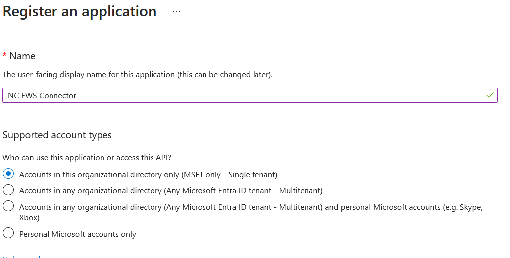
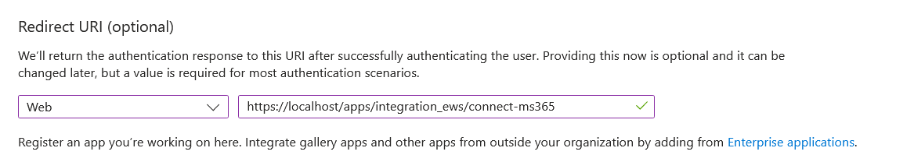
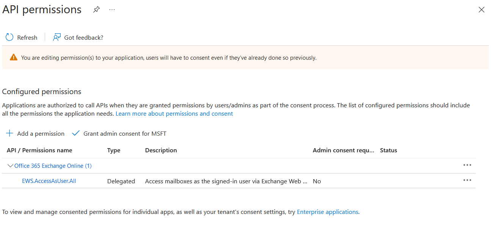
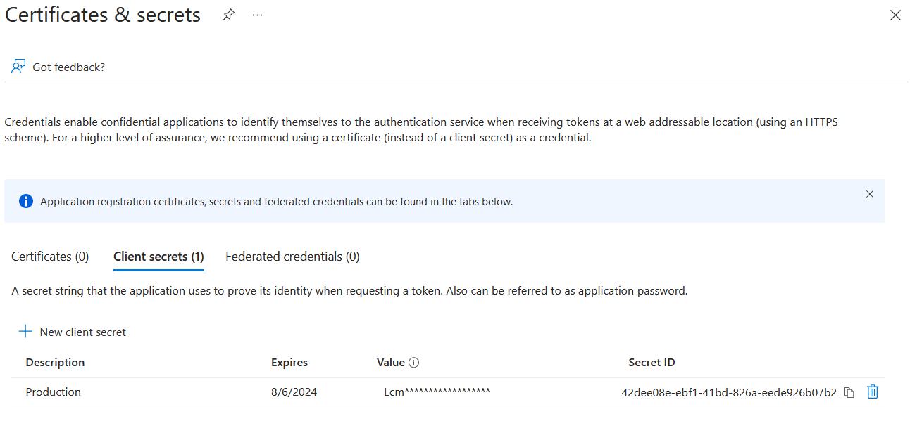

# Microsoft Exchange 365 Configuration

For the integration app to work with Exchange 365, you will require 3 pieces of information, Tenate ID, Application ID and Application Secret, this information needs to be entered in the "EWS Connector" section in the "Administrator" settings in Nextcloud.

## Step 1 - Create Application Registration

- Login to the Azure control panel [https://portal.azure.com](https://portal.azure.com).

- Navigate to the "Microsoft Entra ID" section.

- Navigate to the "App registrations" section (left menu).

- Click + New Registration and fill in the following values

    - Name: NC EWS Connector
    - Types: Accounts in this organizational directory only (MSFT only - Single tenant)
    - Redirect URI: (Web) https://fqdn.domain.tdl/apps/integration_ews/connect-ms365 (replace fqdn.domain.tdl with you NC domain)

## Step 2 - Configure API permissions

- Make sure you are in the "NC EWS Connector" settings section, if not click on the "NC EWS Connector" app name in the "App registrations" screen.

- Navigate to the "API permissions" section.

- Click "+ add permissions", then in the side popout, click "APIs my organization uses" then "Office 365 Exchange Online" and "Delegated permissions". Scroll down to "EWS" and select "EWS.AccessAsUser.All". Then click the "add permissions" button.

- You should now have the following permissions as below, you can remove any other permissions that exist.

## Step 3 - Configure Secret

- Make sure you are in the "NC EWS Connector" settings section, if not click on the "NC EWS Connector" app name in the "App registrations" screen.

- Navigate to the "Certificates & secrets" section.

- Click "+ new client secret", then in the side popout, fillin in the description "Production" and select the expiry time. Then click "add" button.

- After the screen updates, copy the "Value" as this can not be retrieved later.

- You should now have the following secret as below.

## Step 4 - Configure Nextcloud

- Make sure you are in the "NC EWS Connector" settings section, if not click on the "NC EWS Connector" app name in the "App registrations" screen.

- Navigate to the "Overview" section.

- Copy the Tenet Id, Application Id, and Secret (from step 3) to the "EWS Connector" section in the "Administraion" settings in Nextcloud.

## Step 5 - Enjoy the APP